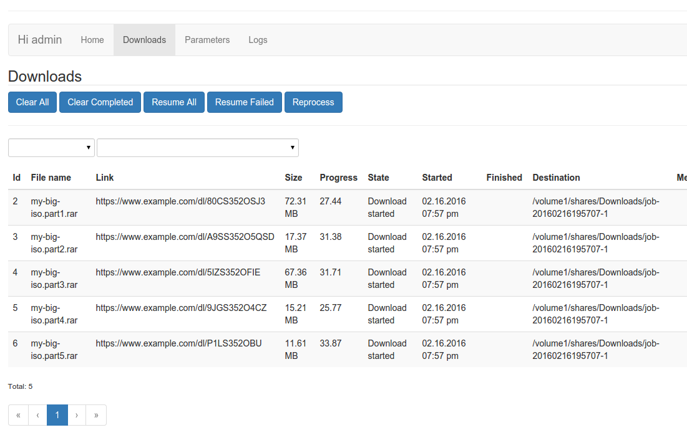

# Tartana

Open source PHP app which manages downloads for you on any PHP capable device (Raspberry Pi up to big servers). It supports link decryption as well as all important container formats like dlc or rsdf and automatic file extraction. It just works and makes fun!

## Installation
The installation is as simple as 123. Head on to the [installation guide](doc/main/installation.md).

## Features
- Runs on a simple low resource [environment](doc/main/requirements.md).
- Modern architecture with support for PHP 5.5 up to 7 and HHVM.
- Premium account support for [one click hosters](doc/main/hosters.md).
- Runs in [different modes](doc/main/running.md): command line, an existing web server infrastructure or as standalone web server.
- Scans a folder for link files and manages the downloads locally or trough a [Synology Download Station](doc/main/synology.md).
- Auto extract archive files which are downloaded.
- Made with stability in mind.

## Screenshot

## Credits
This project is inspired by the popular [[PyLoad app](https://github.com/pyload/pyload)] but it should be not so buggy, as it has a decent unit test code coverage. Beside that we would like to say thanks to the following projects:

- [Symfony](https://symfony.com)
- [Angular JS](https://angularjs.org)
- [jQuery](https://jquery.com)
- [Bootstrap](http://getbootstrap.com)
- [Doctrine](http://www.doctrine-project.org)
- [Flysystems](http://flysystem.thephpleague.com)
- [Guzzle](http://guzzlephp.org)
- [Monolog](https://github.com/Seldaek/monolog)
- [Composer](https://getcomposer.org)
- And all the other Open Source projects we are using